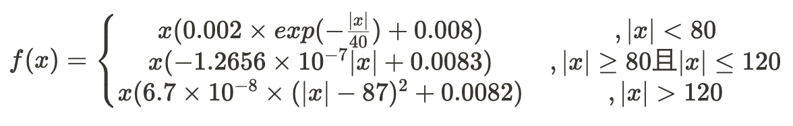
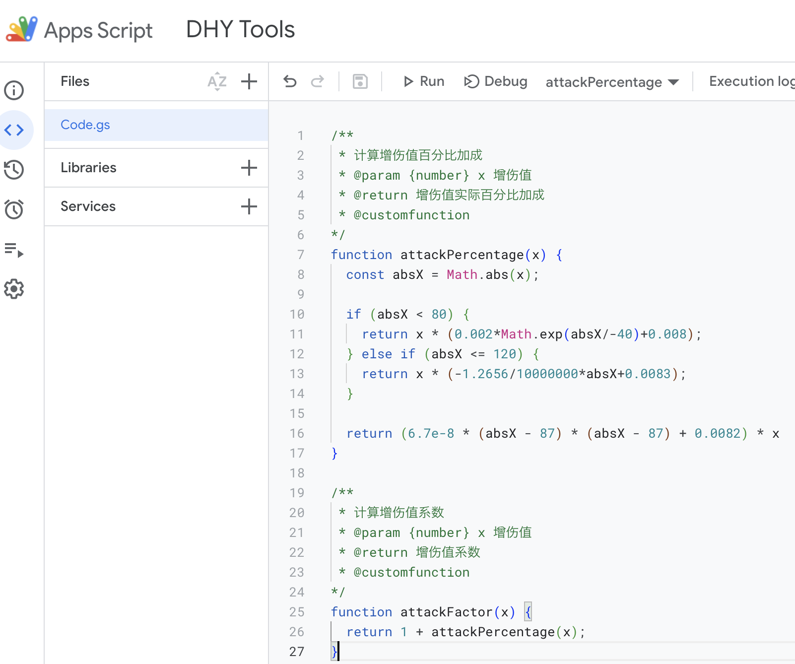

# 增伤值系数快速计算

我们知道【增伤值系数=1+增伤值百分比】。其中增伤值百分比是以增伤值为自变量的函数$f(x)$。
该函数的拟合结果为：


## Excel添加自定义函数

打开一个excel表格，在菜单栏找到【开发工具】选项

> 如果选项卡内没有【开发工具】，打开【文件】-【Excel选项】中的【自定义功能区】进行勾选设置。
> 

找到【开发工具】后，选择【Visual Basic】。
点击【插入模块】，可以给模块随便起个名字

然后在编辑框里输入以下代码：

```vba
Function attackPercentage(x)
    Dim absX As Double
    absX = Abs(x)
    If absX < 80 Then
        attackPercentage = x * (0.002 * Exp(absX / -40) + 0.008)
    Else
        attackPercentage = x * (-1.2656 / 10000000 * absX + 0.0083)
    End If
End Function

Function attackFactor(x)
    attackFactor = 1 + attackPercentage(x)
End Function
```


【保存】后就可以使用了。

* `attackPercentage`计算的是增伤值百分比
* `attackFactor`直接计算增伤值系数
  

## Google Sheet添加自定义函数

打开【Extensions - Apps Script】，在弹出来的编辑器里插入以下代码：

```javascript
/**
 * 计算增伤值百分比加成
 * @param {number} x 增伤值
 * @return 增伤值实际百分比加成
 * @customfunction
 */
function attackPercentage(x) {
    const absX = Math.abs(x);

    if (absX < 80) {
        return x * (0.002 * Math.exp(absX / -40) + 0.008);
    }

    return x * (-1.2656 / 10000000 * absX + 0.0083);
}

/**
 * 计算增伤值系数
 * @param {number} x 增伤值
 * @return 增伤值系数
 * @customfunction
 */
function attackFactor(x) {
    return 1 + attackPercentage(x);
}
```


【保存】后就可以使用了。

* `attackPercentage`计算的是增伤值百分比
* `attackFactor`直接计算增伤值系数
  

